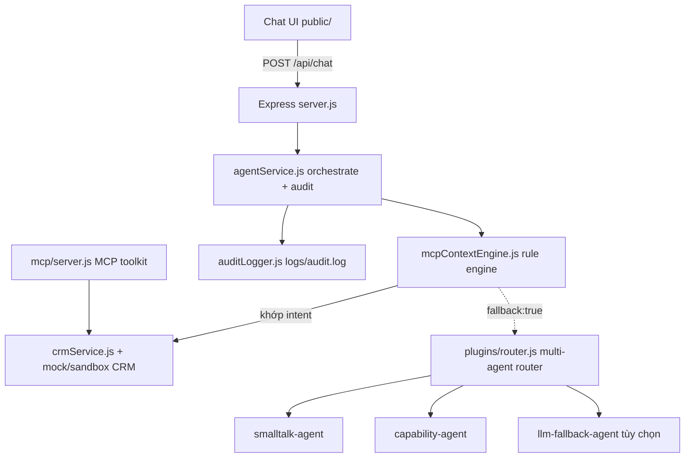

# BankRM Copilot - AI Agent CRM MVP

BankRM Copilot là MVP AI Agent cho CRM, phục vụ Relationship Manager (RM) của Bank A trong các luồng chăm sóc khách hàng bằng tiếng Việt.

Dự án tập trung vào 4 năng lực chính:

- Chat tiếng Việt cho RM, hỗ trợ có dấu và không dấu.
- MCP-style context engine để chuyển ngữ cảnh giữa các module CRM.
- Gợi ý next-best-action, soạn email follow-up và call script cá nhân hóa.
- Audit log đầy đủ cho mỗi lượt xử lý agent/LLM.

Đây là bản demo/pilot dùng dữ liệu sandbox/mock. Không sử dụng dữ liệu khách hàng thật.

---

## 1. Tính năng chính

- Giao diện chat web trong `public/`, dùng HTML/CSS/JS thuần.
- Backend Express trong `src/server.js`, không có bước build.
- Rule engine IF/ELSE trong `src/services/mcpContextEngine.js`.
- Multi-agent fallback router trong `src/plugins/router.js`.
- Agent nội bộ cho smalltalk và hướng dẫn năng lực trong `src/plugins/agents/internalAgents.js`.
- LLM fallback tùy chọn qua proxy OpenAI-compatible trong `src/plugins/agents/llmAgent.js`.
- Truy vấn CRM mock hoặc sandbox API qua `src/services/crmService.js`.
- Sinh và nạp dữ liệu mock lớn khoảng 10.000 khách hàng.
- Audit log dạng file JSONL/NDJSON qua `src/services/auditLogger.js`.
- MCP toolkit qua stdio trong `src/mcp/server.js`.

Luồng nghiệp vụ đã hỗ trợ:

- Nhắc khách hàng có tiết kiệm sắp đến hạn.
- Soạn email chăm sóc/tái tục.
- Soạn call script.
- Tra cứu thông tin khách hàng theo tên.
- Gợi ý cơ hội bán chéo.
- Liệt kê chiến dịch đang chạy.
- Trả lời câu chào hỏi và câu hỏi “bạn làm được gì”.

---

## 2. Công nghệ

| Thành phần | Công nghệ |
| --- | --- |
| Runtime | Node.js ESM, yêu cầu `>=20 <25` |
| Backend | Express |
| Frontend | HTML/CSS/JS thuần trong `public/` |
| Validation/MCP | `zod`, `@modelcontextprotocol/sdk` |
| Test | `node --test` |
| Lint/format | ESLint, Prettier |
| Build | Không có bước build |

---

## 3. Chạy local

Cài dependency:

```bash
npm install
```

Chạy server:

```bash
npm start
```

Mở trình duyệt tại:

```text
http://localhost:3000
```

Chạy watch mode khi phát triển:

```bash
npm run dev
```

Chạy MCP toolkit qua stdio:

```bash
npm run mcp
```

---

## 4. Dữ liệu mock lớn

Repo có sẵn dữ liệu CRM mock nền trong `src/services/crmData.js` và các file dữ liệu bổ sung trong `src/data/mock/`.

Các file dữ liệu lớn:

| File | Vai trò |
| --- | --- |
| `src/data/mock/large_customers.json` | Khoảng 10.000 khách hàng synthetic |
| `src/data/mock/large_opportunities.json` | Cơ hội bán chéo sinh từ tập khách hàng lớn |
| `src/data/mock/large_interactions.json` | Lịch sử tương tác sinh từ tập khách hàng lớn |
| `src/data/mock/email_templates.json` | Template email chăm sóc |
| `src/data/mock/call_scripts.json` | Template call script |
| `src/data/mock/bank_a_crm_test_cases.json` | Test cases nghiệp vụ CRM |

Khi chạy ở chế độ mock local, `crmService.js` tự gộp dữ liệu nền với các file `large_*.json` nếu các file này tồn tại.

Sinh lại dữ liệu mock lớn:

```bash
node scripts/data/generate-large-mock-data.mjs
```

Script sinh dữ liệu deterministic bằng seeded random để kết quả ổn định giữa các lần chạy. Dữ liệu là synthetic/mock, gồm tên, phân khúc, sản phẩm, ngày đáo hạn, opportunity và interaction giả lập. Không chứa thông tin cá nhân thật.

Lưu ý khi làm việc với dữ liệu lớn:

- Không gọi API bên thứ ba để sinh dữ liệu.
- Không đưa dữ liệu thật, secret hoặc thông tin định danh cá nhân thật vào repo.
- Nếu cần thay đổi cấu trúc dữ liệu, phải giữ tương thích với các hàm trong `crmService.js`.
- Sau khi regenerate dữ liệu, chạy lại `npm run check` và `npm run smoke:local`.

---

## 5. Biến môi trường

Có thể sao chép `.env.example` thành `.env` để chạy local:

```bash
cp .env.example .env
```

Trên Windows PowerShell:

```powershell
Copy-Item .env.example .env
```

Các biến chính:

| Biến | Mặc định/ý nghĩa |
| --- | --- |
| `PORT` | Cổng Express, mặc định `3000` |
| `CORS_ORIGIN` | Origin được phép gọi API, mặc định `*` |
| `AUDIT_LOG_DIR` | Thư mục ghi audit log, mặc định `logs/` hoặc `/tmp/bankrm-logs` trên Vercel |
| `CRM_MODE` | Nguồn CRM: `mock`, `sqlite`, `postgres` hoặc `sandbox`; pilot/production cấm `mock` |
| `CRM_SQLITE_PATH` | File SQLite, mặc định `db/crm.db` tính từ repo root |
| `CRM_POSTGRES_URL` | Chuỗi kết nối PostgreSQL, chỉ đặt qua secret của môi trường |
| `CRM_API_BASE_URL` | Base URL của CRM sandbox API |
| `CRM_API_KEY` | API key CRM sandbox |
| `CRM_API_AUTH_SCHEME` | `api-key` hoặc `bearer` |
| `CRM_API_KEY_HEADER` | Tên header API key, mặc định `X-API-Key` |
| `CRM_TIMEOUT_MS` | Timeout CRM từ `1` đến `120000` ms, mặc định `5000` |
| `CRM_BUSINESS_DATE` | Ngày nghiệp vụ cố định, ví dụ `2026-07-08` |
| `LLM_API_URL` | Endpoint proxy LLM tương thích Chat Completions |
| `LLM_API_KEY` | Key gọi proxy LLM đã được phê duyệt |
| `LLM_MODEL` | Model LLM, mặc định `gpt-4o-mini` |

Nếu không đặt `LLM_API_URL` và `LLM_API_KEY`, hệ thống không gọi LLM bên ngoài. Fallback chỉ dùng agent nội bộ và câu trả lời tĩnh.

Khởi tạo và kiểm tra SQLite local:

```bash
npm run db:init
npm run db:verify
CRM_MODE=sqlite npm run test:crm
```

---

## 6. Kiến trúc



Luồng xử lý một lượt chat:

1. Frontend gửi `POST /api/chat` với `{ conversationId, message }`.
2. `agentService.js` tạo `auditId`, gọi `routeConversation()`.
3. `mcpContextEngine.js` chuẩn hóa tiếng Việt qua `normalizeVietnamese()` và match intent.
4. Nếu match intent CRM, engine gọi `crmService.js`.
5. Nếu không match, engine trả `fallback: true`, `agentService.js` gọi `dispatchFallback()`.
6. Router thử các agent theo priority: smalltalk, capability, LLM fallback nếu được bật.
7. `agentService.js` ghi audit log và trả response.
8. Frontend chỉ hiển thị nội dung RM cần đọc, không hiển thị `auditId`, `module`, `latencyMs` hay raw endpoint kỹ thuật.

Mỗi phản hồi agent cần giữ cấu trúc:

```js
{
  reply: "Nội dung trả lời tiếng Việt",
  sources: [{ endpoint: "GET /customers" }],
  context: {
    currentModule: "customer-profile",
    focusedCustomers: ["C001"],
    lastIntent: "maturity-reminder"
  }
}
```

---

## 7. API endpoints

| Method | Endpoint | Mô tả |
| --- | --- | --- |
| `GET` | `/api/health` | Health check |
| `POST` | `/api/chat` | Gửi một lượt chat |
| `GET` | `/api/agents` | Liệt kê agent trong registry |
| `GET` | `/api/audit-logs` | Xem audit log gần nhất |
| `GET` | `/api/crm/customers` | Danh sách khách hàng |
| `GET` | `/api/crm/opportunities` | Danh sách cơ hội bán chéo |
| `GET` | `/api/crm/interactions` | Lịch sử tương tác |
| `GET` | `/api/crm/campaigns` | Danh sách chiến dịch |
| `POST` | `/api/draft-email` | Soạn email cho khách hàng |
| `POST` | `/api/call-script` | Soạn call script cho khách hàng |

Ví dụ gọi chat:

```bash
curl -X POST http://localhost:3000/api/chat \
  -H "Content-Type: application/json" \
  -d "{\"conversationId\":\"demo-1\",\"message\":\"Nhắc tôi khách hàng đến hạn tuần này\"}"
```

Response mẫu:

```json
{
  "auditId": "uuid",
  "reply": "Em đã lọc ...",
  "sources": [{ "endpoint": "GET /customers" }],
  "context": {
    "currentModule": "customer-profile",
    "focusedCustomers": ["C001"],
    "lastIntent": "maturity-reminder"
  },
  "latencyMs": 12
}
```

Lưu ý: API có thể trả metadata để phục vụ truy vết, nhưng frontend không hiển thị metadata kỹ thuật cho RM.

---

## 8. Prompt demo

| Mục tiêu | Prompt |
| --- | --- |
| Nhắc đến hạn | `Nhắc tôi những khách hàng có tiết kiệm đến hạn trong tuần này` |
| Phím tắt nhắc đến hạn | `1` |
| Soạn email | `Soạn email cho nhóm này` |
| Phím tắt email | `2` |
| Gợi ý cơ hội | `Khách Nguyễn Văn An có cơ hội mua bảo hiểm nào phù hợp không?` |
| Phím tắt opportunity | `3` |
| Xem chiến dịch | `Cho tôi danh sách chiến dịch đang chạy` |
| Phím tắt campaign | `4` |
| Call script | `Soạn kịch bản gọi cho khách Nguyễn Văn An` |
| Smalltalk | `xin chào em` |
| Hướng dẫn | `bạn làm được gì` |

Hệ thống hỗ trợ input không dấu, ví dụ:

```text
nhac khach hang den han
soan email cho nhom nay
ban lam duoc gi
```

---

## 9. Scripts kiểm thử và chất lượng

| Lệnh | Mục đích |
| --- | --- |
| `npm test` | Chạy toàn bộ test bằng `node --test` |
| `npm run test:http` | Chạy riêng HTTP API tests |
| `npm run test:crm` | Chạy bộ CRM test cases |
| `npm run lint` | Chạy ESLint |
| `npm run format:check` | Kiểm tra Prettier |
| `npm run check` | Chạy lint, test và CRM test cases |
| `npm run smoke:local` | Smoke test local cho health và chat |

Checklist trước khi kết luận hoàn tất một thay đổi:

```bash
npm run check
npm run smoke:local
npm run format:check
git diff --check
```

Hiện repo có thể còn warning lint cũ ở một số file nếu chưa được xử lý trong task hiện tại. Không nên bỏ qua lỗi test hoặc lỗi runtime.

---

## 10. Cấu trúc thư mục

```text
CRM_MVP/
  api/
  public/
    index.html              # Chat UI
    app.js                  # Gọi API chat + render phản hồi
    styles.css              # Giao diện chat
    config.js               # Cấu hình frontend runtime
  src/
    server.js               # Express API + static hosting
    services/
      agentService.js       # Orchestrate một lượt chat + audit
      auditLogger.js        # Ghi audit log
      crmData.js            # Mock data nền
      crmService.js         # Query CRM + draft email/call script
      mcpContextEngine.js   # Rule engine IF/ELSE + context switching
      textUtils.js          # Chuẩn hóa tiếng Việt
    plugins/
      router.js             # Multi-agent registry + fallback router
      llmFallback.js        # Gọi LLM proxy
      agents/
        internalAgents.js   # smalltalk-agent, capability-agent
        llmAgent.js         # llm-fallback-agent
    mcp/
      server.js             # MCP toolkit qua stdio
    data/mock/
      large_customers.json
      large_opportunities.json
      large_interactions.json
      email_templates.json
      call_scripts.json
      bank_a_crm_test_cases.json
  scripts/
    data/
      generate-large-mock-data.mjs
    qa/
      run-crm-test-cases.mjs
      smoke-local.mjs
    docs/
      generate-architecture.mjs
  tests/
    integration/
      http-api.test.mjs
  docs/
    architecture/
      architecture.md
      architecture.drawio
      bankrm-if-else-workflow.drawio
    plans/
      AGENT_EXECUTION_PLAN.md
      AGENT_UPGRADE_PLAN.md
    integrations/
      integration-proposal.md
      mcp-toolkit.md
      multi-agent-router.md
    skills/
      drawio-system-architecture-guide.md
  skills/
  evidence/
  logs/                     # Tự sinh khi chạy local
  AGENTS.md
  RULES.md
  .env.example
```

---

## 11. MCP toolkit

Chạy:

```bash
npm run mcp
```

Các tool CRM đang expose:

| Tool | Mô tả |
| --- | --- |
| `crm_list_customers` | Liệt kê khách hàng |
| `crm_get_customer` | Lấy hồ sơ khách hàng theo tên |
| `crm_customers_due` | Lấy khách hàng đến hạn trong N ngày |
| `crm_list_opportunities` | Liệt kê cơ hội bán hàng |
| `crm_list_interactions` | Liệt kê lịch sử tương tác |
| `crm_list_campaigns` | Liệt kê chiến dịch |
| `crm_draft_email` | Soạn email follow-up |
| `crm_call_script` | Soạn call script |

Mỗi tool call cũng ghi audit log với provider `mcp-toolkit`.

---

## 12. Bảo mật và tuân thủ

Nguyên tắc theo đề bài Bank A:

- Ghi audit log đầy đủ cho mọi lượt agent/LLM/tool call.
- Không train model trên dataset khách hàng.
- Không gọi API bên thứ ba chưa được phê duyệt.
- Mọi LLM call phải đi qua proxy có logging.
- Không hiển thị metadata kỹ thuật trên frontend RM.
- Không dùng dữ liệu cá nhân thật trong mock data.
- Tuân thủ Luật An ninh mạng 2018 và Nghị định 13/2023/NĐ-CP.

Frontend chỉ hiển thị nhãn nguồn thân thiện:

- `Nguồn dữ liệu: Hệ thống CRM` nếu phản hồi dùng source CRM/API.
- `Nguồn dữ liệu: Nội bộ` nếu phản hồi chỉ dùng agent nội bộ.

Raw endpoint vẫn nằm trong API payload và audit log để phục vụ truy vết.

---

## 13. Trạng thái hiện tại

Đã có:

- CRM MVP chạy được local.
- Rule engine cho các intent CRM chính.
- Multi-agent fallback router.
- LLM fallback tùy chọn qua proxy.
- Dữ liệu mock lớn khoảng 10.000 khách hàng.
- HTTP API tests.
- CRM business test cases.
- Smoke test local.
- ESLint và Prettier check.
- MCP toolkit.
- Audit logging.

Hạn chế đã biết:

- Context store đang dùng `Map` in-memory, sẽ mất khi restart.
- Audit log local đang là file, production nên chuyển sang log tập trung/SIEM.
- Chưa có authentication/RBAC cho RM.
- LLM fallback cần bổ sung guardrail/PII masking trước pilot thực tế.
- Dữ liệu sandbox/mock chưa thay thế được CRM thật.
- Dữ liệu lớn hiện là file JSON local, phù hợp demo nhưng chưa phải thiết kế data layer production.

---

## 14. Roadmap

| Giai đoạn | Mục tiêu |
| --- | --- |
| P0 - MVP | Rule engine, mock CRM, chat UI, audit, multi-agent fallback |
| P1 - Data grounding | Kết nối CRM/core banking sandbox API qua MCP/context layer |
| P2 - Security pilot | Authentication, RBAC, audit tập trung, PII masking |
| P3 - LLM pilot | Bật LLM qua proxy có guardrail và logging |
| P4 - Agent expansion | Thêm agent chuyên biệt cho product, risk, appointment, NBA nâng cao |
| P5 - Production readiness | Redis/DB context store, observability, CI/CD, HA |

---

## 15. Quy ước phát triển

- Dùng ESM `import/export`, không dùng `require`.
- Nội dung hiển thị cho RM phải là tiếng Việt có dấu, UTF-8.
- Intent matching phải chuẩn hóa qua `normalizeVietnamese()`.
- Mỗi phản hồi agent phải có `sources`.
- Không hiển thị `auditId`, `module`, `latencyMs` trên frontend.
- Không refactor rộng nếu chỉ thêm một intent hoặc một nguồn dữ liệu nhỏ.
- Khi thêm tính năng mới:
  1. Cập nhật rule trong `mcpContextEngine.js`.
  2. Cập nhật hàm truy vấn trong `crmService.js` nếu cần.
  3. Luôn trả `{ reply, sources, context }`.
  4. Thêm/cập nhật test.
  5. Chạy checklist kiểm thử trước khi kết luận.
