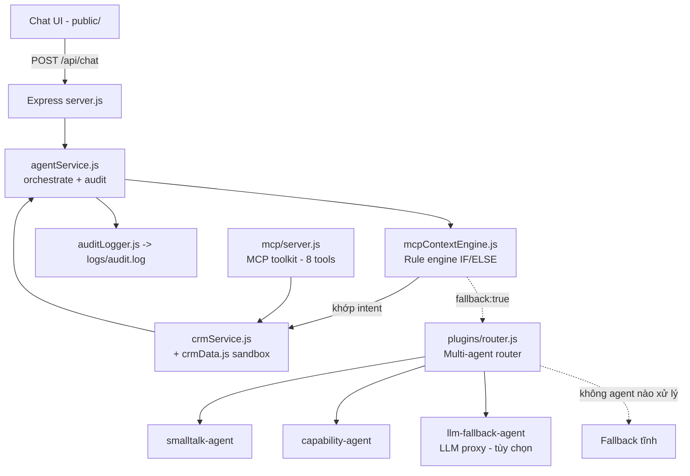

# BankRM Copilot — AI Agent CRM (MVP)

> AI Agent CRM tiếng Việt hỗ trợ **Relationship Manager (RM)** của Bank A.
> Đề bài: Vietnam Innovation Challenge 2026 — Challenge #16 (AI Agents cho CRM).

Chat tiếng Việt cho RM, chuyển context giữa nhiều module CRM (MCP-style), soạn
email/call script, gợi ý next-best-action, kiến trúc **multi-agent có router điều
hướng + dự phòng theo lớp**, và **audit log** đầy đủ cho mọi lượt xử lý.

---

## 1. Tính năng chính

- 💬 Giao diện chat web tiếng Việt (có dấu, UTF-8) cho RM.
- 🔀 **MCP context engine** (IF/ELSE) chuyển context giữa các module:
  Customer profile · Opportunity · Interaction · Campaign.
- 🧩 **Multi-agent router** (plugin) với các agent "chờ sẵn" + dự phòng theo chuỗi.
- ✉️ Agent actions: nhắc đến hạn tiết kiệm · soạn email follow-up · call script ·
  gợi ý cơ hội bán chéo · liệt kê chiến dịch.
- 🗣️ Hỗ trợ input **có dấu, không dấu, viết tắt nghiệp vụ (KH/RM/CBNV)** và phím tắt số.
- 🔐 Audit log cho mọi turn (`logs/audit.log`) + `GET /api/audit-logs`.
- 🛠️ **MCP toolkit** (`src/mcp/server.js`) expose 8 tool CRM qua stdio.

---

## 2. Kiến trúc (Architecture)



**Hai lớp điều hướng:**

1. **Rule engine** (`mcpContextEngine.js`) — lớp chính, xử lý intent CRM cốt lõi.
   Không khớp → trả `{ fallback: true }`.
2. **Multi-agent router** (`plugins/router.js`) — kích hoạt khi fallback; thử lần
   lượt các agent theo `priority` + `match()`; agent lỗi/không match → chuyển agent
   kế; cạn → fallback tĩnh. Chi tiết: [`docs/multi-agent-router.md`](docs/multi-agent-router.md).

Mọi phản hồi tuân theo cấu trúc `{ reply, sources, context }`.

---

## 3. Cài đặt và chạy local

```bash
npm install
npm start          # http://localhost:3000
npm run dev        # watch mode
npm run mcp        # chạy MCP toolkit qua stdio
```

Cấu hình LLM fallback (tùy chọn): sao chép `.env.example` → `.env` và điền
`LLM_API_URL`, `LLM_API_KEY`, `LLM_MODEL`. Nếu bỏ trống, hệ thống **không gọi API
bên ngoài** và chỉ dùng agent nội bộ + fallback tĩnh.

---

## 4. Ví dụ prompt demo

| # | Prompt |
|---|--------|
| 1 | `Nhắc tôi những khách hàng có tiết kiệm đến hạn trong tuần này` |
| 2 | `Soạn email cho nhóm này` |
| 3 | `Khách Nguyen Van An có cơ hội mua bảo hiểm nào phù hợp không?` |
| 4 | `Cho tôi danh sách chiến dịch đang chạy` |
| 5 | `xin chào em` / `bạn làm được gì` (multi-agent nội bộ) |

Hỗ trợ cả gõ không dấu và phím tắt số `1` `2` `4`.

---

## 5. API endpoints

| Method | Endpoint | Mô tả |
|--------|----------|-------|
| POST | `/api/chat` | Gửi 1 lượt chat (`{ conversationId, message }`) |
| GET | `/api/health` | Health check |
| GET | `/api/agents` | Liệt kê agent plugin trong registry |
| GET | `/api/audit-logs` | Xem audit log gần nhất |
| GET | `/api/crm/customers` | Danh sách khách hàng (sandbox) |
| GET | `/api/crm/opportunities` | Cơ hội bán chéo |
| GET | `/api/crm/interactions` | Lịch sử tương tác |
| GET | `/api/crm/campaigns` | Chiến dịch |

---

## 6. Cấu trúc thư mục

```text
CRM_MVP/
  public/                  # Chat UI (index.html, app.js, styles.css)
  src/
    server.js              # Express API + static hosting
    services/
      mcpContextEngine.js  # Rule engine IF/ELSE + context switching
      crmService.js        # Query CRM + draft email/call script
      crmData.js           # Mock data sandbox
      agentService.js      # Orchestrate 1 lượt chat + audit
      auditLogger.js       # Ghi audit log
      textUtils.js         # Chuẩn hóa tiếng Việt (bỏ dấu)
    plugins/
      router.js            # Multi-agent registry + router điều hướng
      llmFallback.js       # Gọi LLM proxy (OpenAI-compatible)
      agents/
        internalAgents.js  # smalltalk-agent, capability-agent
        llmAgent.js        # llm-fallback-agent (dự phòng cuối)
    mcp/
      server.js            # MCP toolkit (8 tools) qua stdio
  docs/
    architecture.md
    integration-proposal.md
    mcp-toolkit.md
    multi-agent-router.md
  skills/                  # Định nghĩa skill cho agent
  logs/audit.log           # Tự sinh
  AGENTS.md · RULES.md · .env.example · mcp.config.json
```

---

## 7. Checklist trạng thái

### Đã hoàn thành
- [x] Scaffold CRM MVP chạy được (Express + UI thuần)
- [x] Tiếng Việt có dấu UTF-8 toàn bộ UI + response
- [x] Hỗ trợ input không dấu + phím tắt số
- [x] Ẩn metadata kỹ thuật khỏi frontend (chỉ hiển thị `reply`)
- [x] AGENTS.md + `.github/copilot-instructions.md` + `skills/`
- [x] MCP toolkit (8 tools) + `RULES.md`
- [x] Plugin LLM fallback qua proxy có logging
- [x] Multi-agent router + registry chờ sẵn + dự phòng theo chuỗi
- [x] `GET /api/agents` + audit `router:*` / `agent-error:*`
- [x] Tài liệu kiến trúc (`docs/multi-agent-router.md`) + README

### Việc còn lại / hạn chế đã biết (Issues)
- [ ] Dữ liệu CRM vẫn là **mock sandbox** — cần tích hợp CRM thật (xem `docs/integration-proposal.md`)
- [ ] Context store để **in-memory** (`Map`) — mất khi restart; cần Redis/DB cho production
- [ ] Chưa có **xác thực/RBAC** cho RM và phân quyền dữ liệu khách hàng
- [ ] Chưa có **test runner / linter** cấu hình sẵn
- [ ] LLM proxy mới ở mức OpenAI-compatible — cần bọc guardrail/PII masking trước khi pilot
- [ ] Audit log dạng file phẳng — cần chuyển sang log tập trung (SIEM) cho tuân thủ

---

## 8. Roadmap

| Giai đoạn | Mục tiêu |
|-----------|----------|
| **P0 — MVP (hiện tại)** | Rule engine + multi-agent router + mock CRM + audit |
| **P1 — Grounding thật** | Kết nối CRM/core-banking API qua MCP; thay mock bằng dữ liệu thật (read-only) |
| **P2 — LLM pilot** | Bật LLM qua proxy có logging + PII masking + guardrail; A/B với rule engine |
| **P3 — Bảo mật & tuân thủ** | Xác thực RM, RBAC theo phân khúc, audit tập trung (Luật ANM 2018, NĐ 13/2023) |
| **P4 — Mở rộng năng lực** | Agent chuyên biệt: tra cứu sản phẩm, chấm điểm rủi ro, đặt lịch, next-best-action nâng cao |
| **P5 — Production** | Context store bền vững (Redis/DB), quan trắc, CI/CD, test tự động, HA |

---

## 9. Bảo mật & tuân thủ

- Ghi audit log đầy đủ cho **mọi** lượt LLM/agent call.
- **Không** train model trên dataset khách hàng.
- **Không** gọi API bên thứ 3 chưa được phê duyệt; mọi LLM call phải qua proxy có logging.
- Tuân thủ **Luật An ninh mạng 2018** và **Nghị định 13/2023/NĐ-CP**.
- Chi tiết quy tắc: [`RULES.md`](RULES.md) · hướng dẫn agent: [`AGENTS.md`](AGENTS.md).

---

## 10. Phạm vi MVP

Dữ liệu CRM là mock sandbox; engine chính là rule-based để demo luồng MCP và
context management; LLM là lớp dự phòng tùy chọn. Kiến trúc plugin cho phép mở rộng
thêm agent mà không phá vỡ luồng hiện có.
