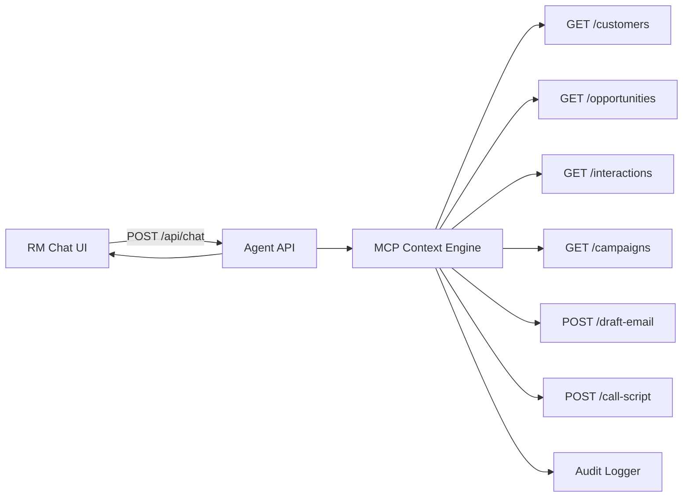

# Architecture - CRM AI Agent MVP

## Tong quan

He thong gom 3 lop:

1. **Frontend Web Chat (RM UI)**: giao dien chat tieng Viet.
2. **Agent Backend (Node.js/Express)**: quan ly hoi thoai, routing IF/ELSE, context switching.
3. **CRM Context Layer (MCP-style)**: truy van nhieu module CRM va tong hop phan hoi co nguon.

## Luong du lieu

## Context model

Moi `conversationId` co state rieng:

- `currentModule`: module CRM dang active
- `focusedCustomers`: danh sach KH dang duoc tham chieu
- `lastIntent`: intent gan nhat

Dieu nay giup agent giu ngu canh da luot hoi thoai va chuyen module khong mat context.

## IF/ELSE workflow (tom tat)

1. Neu chat ve "nhac den han tiet kiem" -> module `customer-profile`, loc KH den han.
2. Neu chat "soan email" -> module `interaction`, tao email draft theo danh sach KH focus.
3. Neu chat "call script" -> module `interaction`, tao script goi cho KH dang focus.
4. Neu chat "chien dich" -> module `campaign`, liet ke chien dich active.
5. Neu chat theo ten KH -> module `opportunity`, tong hop profile + co hoi + lich su.

## Bao mat va audit

- Moi turn chat duoc ghi audit voi `auditId`, prompt, module, sources, latency.
- Log file: `logs/audit.log` (ndjson).
- San sang mo rong logging cho proxy LLM theo yeu cau pilot.
