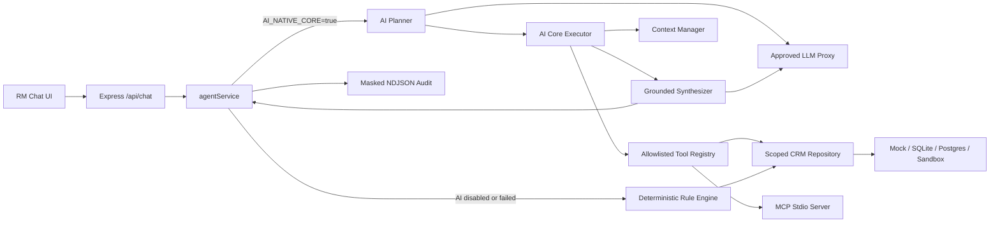

# BankRM AI-Native Core Architecture

## Mục tiêu

AI phải là lõi quyết định và điều phối trong luồng demo, trong khi quyền truy cập dữ liệu, validation, audit và fallback vẫn được kiểm soát bằng code deterministic.

AI-native core được bật bằng `AI_NATIVE_CORE=true`. Nếu proxy chưa được cấu hình, dữ liệu không được phân loại an toàn, planner trả sai schema hoặc hết thời gian, hệ thống quay về rule engine hiện có mà không thay đổi HTTP API.

## Component flow



`toolRegistry.js` là execution layer dùng chung. Chat core và MCP stdio không duy trì hai bộ business tool riêng.

## Một lượt AI-native

1. API xác thực identity và validate message bằng Zod.
2. Context manager tải state theo actor + conversation.
3. Planner nhận message, context và danh sách tool cho phép.
4. Proxy phải trả plan JSON theo schema `{ intent, steps, responseGoal }`.
5. Executor giới hạn số bước và gọi từng tool qua registry.
6. Repository áp RM/branch scope trước khi trả dữ liệu.
7. Context được cập nhật từ tool observations.
8. Synthesizer chỉ được dùng dữ liệu observation và không tự tạo sources.
9. Ứng dụng gắn sources từ tool execution vào response.
10. Audit ghi planning/tool/final decision sau khi mask secret và PII.

## Context contract

```json
{
  "currentModule": "general | customer-profile | interaction | opportunity | campaign",
  "focusedCustomers": ["customer-id"],
  "lastIntent": "intent-name"
}
```

Context có TTL, giới hạn số conversation, giới hạn số customer focus và cô lập theo actor. Snapshot trả ra là immutable; rule engine clone state trước khi cập nhật.

## Safety invariants

- Chỉ gọi LLM qua `LLM_API_URL` là approved proxy; endpoint vendor trực tiếp bị từ chối.
- Chỉ bật LLM khi `AI_DATA_CLASSIFICATION` là `synthetic` hoặc `anonymized`.
- LLM không được gọi CRM hoặc external API trực tiếp.
- Planner chỉ chọn tool nằm trong allowlist và input phải qua Zod.
- Tool result là nguồn sự thật duy nhất của synthesizer.
- RM token và admin token tách biệt; role không được lấy từ header do client tự khai.
- Opportunity, interaction và campaign phải đi qua repository data scope.
- Mọi response nghiệp vụ phải có sources; UI chỉ hiện nhãn nguồn thân thiện.
- Khi AI path lỗi, rule engine xử lý tiếp; không silently fabricate data.

## Demo scenario

Luồng trọng tâm cần chứng minh trong một conversation:

1. Tìm khách hàng có tiết kiệm đến hạn.
2. Soạn email cho nhóm đang focus.
3. Chuyển sang opportunity của một khách hàng.
4. Đọc interaction và campaign phù hợp.

Kết quả phải thể hiện planner chọn chuỗi tool động, sử dụng tối thiểu ba CRM endpoints, giữ context xuyên module và trả citations.

## Production boundary

MVP dùng context và recent audit trong memory, demo token và file NDJSON. Pilot thật phải thay bằng SSO/JWT, Redis/database context store, immutable audit platform và cơ chế token hóa PII trước khi dùng private LLM proxy.
