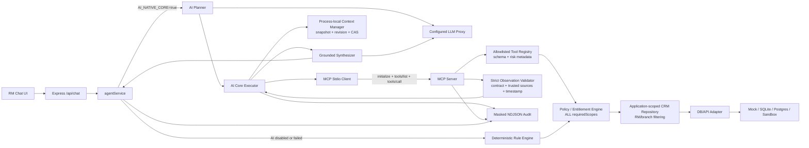

# BankRM AI-Native Core Architecture

> **Tài liệu canonical cho AI/MCP runtime:** Trang này sở hữu luồng planner → MCP →
> synthesis và các invariant hiện hành. Kiến trúc toàn hệ thống và production roadmap
> nằm tại [architecture.md](./architecture.md); contract tool chi tiết nằm tại
> [MCP Toolkit](../integrations/mcp-toolkit.md). Xem
> [mục lục tài liệu](../README.md) để xác định trạng thái tài liệu.

## Mục tiêu

AI phải là lõi quyết định và điều phối trong luồng demo, trong khi quyền truy cập dữ liệu, validation, audit instrumentation và fallback vẫn được kiểm soát bằng code deterministic.

AI-native core được bật bằng `AI_NATIVE_CORE=true`. Nếu proxy chưa được cấu hình, dữ liệu không được phân loại an toàn, planner trả sai schema hoặc hết thời gian, hệ thống quay về rule engine hiện có mà không thay đổi HTTP API.

## Component flow



`toolRegistry.js` là nguồn định nghĩa tool duy nhất. MCP server công bố name, description, input/output schema, scopes, risk, access và source metadata từ registry. `tools/list` chỉ trả tool mà actor có đủ tất cả scope; registry kiểm tra lại ngay trước execution. Planner chỉ thấy catalog đã lọc qua MCP; chat core không gọi `executeAgentTool()` trực tiếp.

## Một lượt AI-native

1. API resolve/validate message bằng Zod; bearer token được xác thực và ánh xạ identity phía server khi `AUTH_ENABLED=true`. Khi auth tắt ở local development, identity lấy từ các header `X-*` hoặc giá trị `default`, chưa phải trust boundary bảo mật.
2. Context manager tải immutable snapshot theo actor + conversation cùng monotonic revision nội bộ.
3. AI core mở một MCP stdio session gắn với identity, entitlement và conversation hiện tại; `tools/list` được lọc theo policy.
4. PII token vault thay các email/phone/tài khoản, CRM ID, tên và field PII có thể nhận diện trong message/context bằng opaque token trước proxy call. Planner nhận payload đã token hóa, catalog và `maxSteps`; tool input chỉ được hoàn nguyên phía ứng dụng. Proxy phải trả strict plan JSON `{ intent, steps, responseGoal }`.
5. Ứng dụng validate plan/schema/budget nguyên vẹn. Plan vượt budget bị từ chối, không truncate, không gọi tool và không synthesis; plan hợp lệ được audit trước execution.
6. Executor gọi từng tool bằng `tools/call` trên cùng session. Registry yêu cầu đủ **tất cả** `requiredScopes` trước input parsing/executor; thiếu scope trả `TOOL_SCOPE_DENIED`.
7. Repository kiểm tra entitlement lại, áp RM/branch application scope và gọi provider. Provider query scope/filter/limit pushdown chưa thuộc Phase 1.
8. MCP child audit execution; client chỉ chấp nhận structured observation đúng status/data/error/errorCode, exact trusted source catalog và timestamp freshness/future tolerance. Observation lỗi dừng trước synthesis/context commit; parent ghi mirror sau validation.
9. AI core tạo draft context trong memory nhưng chưa persist. Synthesizer nhận observation tương quan với từng plan step sau PII tokenization, trả strict reply JSON rồi ứng dụng hoàn nguyên token. Entity-scoped validator từ chối customer/record ID, tên, điện thoại, tài khoản, ngày, số tiền và tỷ lệ không grounded, gồm Unicode/range/dạng rút gọn và thập phân bằng chữ tiếng Việt. Sources do ứng dụng tổng hợp từ observation, không do LLM quyết định.
10. Chỉ sau khi synthesis, grounding, sources và policy hợp lệ, context manager CAS draft theo revision snapshot. Conflict hoặc validation failure giữ nguyên state cũ. MCP session luôn đóng trong `finally`, rồi `agentService` ghi final/fallback audit best-effort.

Tool observation contract:

```json
{
  "status": "success",
  "data": {},
  "sources": [{ "endpoint": "GET /customers" }],
  "observedAt": "2026-07-13T10:00:00.000Z"
}
```

Error observation bắt buộc dùng `status:"error"`, `data:null`, safe `error` và `errorCode` thuộc mapping đã biết; success cấm `error/errorCode`. Trường entitlement/scope không nằm trong observation đưa cho LLM.

## Context contract

```json
{
  "currentModule": "general | customer-profile | interaction | opportunity | campaign",
  "focusedCustomers": ["customer-id"],
  "lastIntent": "intent-name"
}
```

Context có TTL, giới hạn số conversation/customer focus, actor isolation và revision tăng đơn điệu. Snapshot trả ra immutable; cả AI-native lẫn rule engine đều draft rồi CAS sau validation. Revision là metadata nội bộ và không được đưa vào HTTP response.

Contract trên là state nội bộ. `runAgentTurn()` trả thêm `auditId` cùng
`reply/sources/context`; route HTTP `/api/chat` mới bổ sung `latencyMs` vào envelope.

## Safety invariants

- Mọi LLM call trong repo đi qua gateway dùng `LLM_API_URL`. Gateway yêu cầu HTTPS (trừ loopback) và chặn một blocklist hostname/suffix vendor trực tiếp đã biết; hiện chưa có approved-host allowlist hoặc xác thực danh tính proxy.
- Chỉ đi vào AI path khi biến cấu hình tự khai báo `AI_DATA_CLASSIFICATION` là `synthetic` hoặc `anonymized`; repo chưa tự phân loại hay inspect nội dung để xác nhận khai báo này.
- LLM không được gọi CRM hoặc external API trực tiếp.
- Planner chỉ chọn tool trong entitlement-filtered allowlist; input phải qua Zod và plan vượt `maxSteps` bị từ chối không truncate.
- `requiredScopes` được enforce theo logic ALL ở `tools/list`, registry pre-execution, repository và mọi application path. Thiếu quyền trả `TOOL_SCOPE_DENIED`; wildcard `*` chỉ dành cho admin khi cấu hình tường minh phía server.
- Identity và conversation ID nằm trong session environment do backend tạo, không nằm trong planner-controlled tool input.
- MCP child dùng env allowlist; không nhận `LLM_API_KEY`, demo/admin token hoặc raw prompt.
- Planner, synthesizer và LLM fallback dùng cùng application-side PII token vault; audit turn không lưu raw RM message và chuyển `conversationId` do client cung cấp thành mã tương quan HMAC với khóa audit riêng. Protected runtime bắt buộc cấu hình `AUDIT_CORRELATION_KEY`; local demo dùng khóa ngẫu nhiên theo process và truyền cùng khóa cho MCP child. Regex/tokenization hiện tại vẫn phải được thay hoặc bổ sung bằng DLP/NER được Bank A kiểm định trước dữ liệu production.
- Mỗi MCP session có time budget, giới hạn concurrency và cleanup bắt buộc; planner/synthesizer có timeout LLM riêng và tool call không được retry.
- Tool result đã qua strict observation validation là nguồn sự thật duy nhất của synthesizer. Source phải khớp exact catalog tin cậy trong code; timestamp quá cũ hoặc quá xa trong tương lai bị từ chối.
- Khi auth bật, RM token và admin token tách biệt; role không được lấy từ header do client tự khai. Local auth-disabled vẫn chấp nhận header demo và không tạo trust boundary.
- RM token ánh xạ sang user/RM/branch bằng cấu hình server-side; header không thể đổi data scope khi auth bật.
- Mọi đường đọc CRM, kể cả direct HTTP, deterministic và plugin fallback, phải đi qua policy + repository application scope.
- Mọi agent/chat response nghiệp vụ phải có `sources`; UI chỉ hiện nhãn nguồn thân thiện. Các direct CRM/draft HTTP endpoint dùng envelope `{data}` riêng.
- Khi AI path lỗi, rule engine xử lý tiếp. Kết quả deterministic vẫn grounded vào repository; `llm-fallback-agent` dùng strict JSON, code-owned sources và cùng entity-scoped sensitive-claim validator. Free-text product/policy claims vẫn cần knowledge grounding riêng, nên validator không phải bằng chứng grounding hoàn hảo cho mọi loại claim.
- Audit hiện ghi planning thành công, MCP registry/tool observations và kết quả/fallback tại các call site; chưa có event riêng bảo đảm bao phủ mọi HTTP exchange với LLM proxy. File persistence là best-effort và lỗi ghi không chặn chat turn.

## Demo scenario

Luồng trọng tâm cần chứng minh trong một conversation:

1. Tìm khách hàng có tiết kiệm đến hạn.
2. Soạn email cho nhóm đang focus.
3. Chuyển sang opportunity của một khách hàng.
4. Đọc interaction và campaign phù hợp.

Kết quả phải thể hiện planner chọn chuỗi tool động, sử dụng tối thiểu ba CRM endpoints, giữ context xuyên module và trả source metadata có thể truy vết.

## Production boundary

MVP dùng context và recent audit trong memory, demo token và file NDJSON. Guard stdio hiện chỉ nhận diện `VERCEL` và mặc định chặn child process tại đó; các serverless runtime khác phải được đánh giá/cấu hình riêng. Pilot thật phải thay bằng SSO/JWT + entitlement service, Redis/database context store với distributed CAS, immutable audit platform, approved-host/mTLS cho configured proxy, provider-side query scope pushdown và DLP/NER policy bổ sung cho token vault hiện tại.
