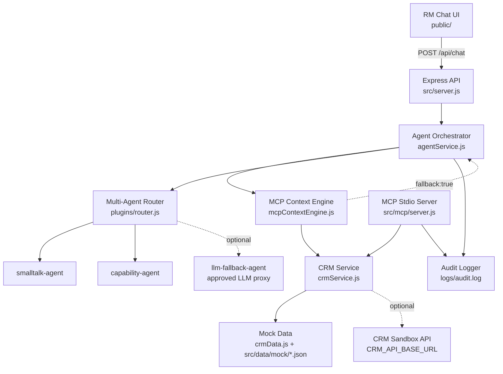
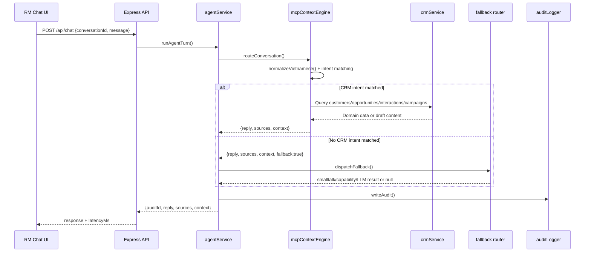
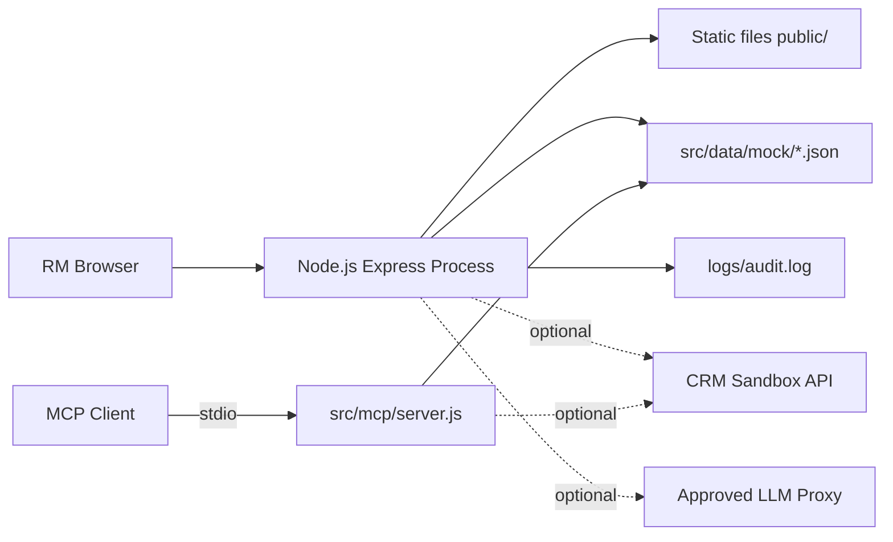

# Phân Tích Kiến Trúc Hệ Thống - BankRM Copilot

## 1. Mục Tiêu Kiến Trúc

BankRM Copilot là MVP AI Agent cho CRM, hỗ trợ Relationship Manager (RM) của Bank A thao tác bằng tiếng Việt trong các luồng chăm sóc khách hàng. Kiến trúc hiện tại ưu tiên:

- Xử lý chắc chắn bằng rule engine trước khi dùng LLM.
- Truy vết được nguồn dữ liệu cho từng câu trả lời.
- Giữ ngữ cảnh hội thoại theo `conversationId`.
- Có audit log cho mỗi lượt agent/tool call.
- Có thể chạy local bằng mock data, đồng thời đã có điểm nối sang CRM sandbox API và LLM proxy khi được phê duyệt.

Đây là kiến trúc demo/pilot. Một số thành phần như context store in-memory, audit file local và dữ liệu JSON local chưa phải thiết kế production.

## 2. Tổng Quan Tầng Hệ Thống

Nhìn tổng quát, hệ thống có 8 tầng. Một số tầng trong MVP đang được triển khai bằng file/mock/in-memory, nhưng vẫn được tách rõ để có đường nâng cấp production:

| Tầng | Hiện tại trong repo | Đích production/pilot | Vai trò |
| --- | --- | --- | --- |
| RM Experience | `public/index.html`, `public/app.js`, `public/styles.css` | Web app nội bộ sau SSO/RBAC | Giao diện chat cho RM, chỉ hiển thị nội dung nghiệp vụ và nhãn nguồn thân thiện. |
| API Gateway / Backend | `src/server.js` | API Gateway nội bộ, auth, rate limit, CORS allowlist | Nhận request HTTP, static hosting, validation cơ bản. |
| Agent Orchestration | `src/services/agentService.js` | Turn orchestration service có policy checks | Tạo `auditId`, gọi rule engine, kích hoạt fallback router nếu cần, ghi audit. |
| Context & Rule Engine | `src/services/mcpContextEngine.js` | Intent/rule registry, context store bền vững | Nhận diện intent, giữ `currentModule`, `focusedCustomers`, `lastIntent`. |
| CRM Domain Adapter | `src/services/crmService.js` | Adapter tách interface tới CRM/core banking | Truy vấn CRM mock/sandbox, sinh email/call script, chuẩn hóa sources. |
| Data & DB | `crmData.js`, `src/data/mock/*.json`, `logs/audit.log`, `Map` in-memory | CRM DB/API, Redis context store, audit DB/SIEM, template repository | Lưu dữ liệu nghiệp vụ, context hội thoại, audit và template. |
| Agent Extensions | `src/plugins/*`, `src/mcp/server.js` | Agent registry có governance, MCP tools quản trị | Multi-agent fallback, LLM fallback qua proxy, MCP toolkit qua stdio. |
| Governance & Observability | Audit NDJSON local, `/api/audit-logs` | Immutable audit, PII masking, metrics/traces/alerts | Tuân thủ, truy vết, giám sát vận hành. |

## 3. Component View



Điểm quan trọng: `mcpContextEngine.js` là đường xử lý chính cho các intent CRM. Router plugin chỉ chạy khi rule engine trả `fallback: true`.

## 4. Luồng Xử Lý Một Lượt Chat



Frontend nhận metadata từ API nhưng không hiển thị các thông tin kỹ thuật như `auditId`, `module`, `latencyMs` hay raw endpoint. UI chỉ thêm nhãn nguồn dạng `Nguồn dữ liệu: Hệ thống CRM` hoặc `Nguồn dữ liệu: Nội bộ`.

## 5. Context Model

Mỗi `conversationId` có một state riêng trong `Map` in-memory:

| Trường | Ý nghĩa |
| --- | --- |
| `currentModule` | Module nghiệp vụ đang active, ví dụ `customer-profile`, `interaction`, `opportunity`, `campaign`, `general`. |
| `focusedCustomers` | Danh sách customer id đang được tham chiếu trong hội thoại. |
| `lastIntent` | Intent gần nhất, ví dụ `maturity-reminder`, `email-draft`, `call-script`, `customer-insight`. |

Context này giúp RM hỏi nối tiếp:

1. RM yêu cầu nhắc khách hàng sắp đáo hạn.
2. Engine lưu các khách hàng vào `focusedCustomers`.
3. RM nói "soạn email cho nhóm này".
4. Engine dùng lại danh sách đã focus để sinh email mà không cần RM nhập lại từng tên.

Giới hạn hiện tại: context store nằm trong memory process, nên mất khi server restart và không chia sẻ được giữa nhiều instance.

## 6. Rule-Based CRM Workflow

Các intent chính đang được xử lý trong `mcpContextEngine.js`:

| Intent | Điều kiện chính | Module | Nguồn dữ liệu |
| --- | --- | --- | --- |
| Nhắc tiết kiệm đến hạn | Phím `1` hoặc câu có `nhắc`, `tiết kiệm`, `đến hạn` | `customer-profile` | `GET /customers` |
| Danh sách chăm sóc hôm nay | Câu có `hôm nay/ngày nay` + khách/chăm sóc/gọi/gặp | `customer-profile` | `GET /customers` |
| Soạn email | Phím `2`, `soạn email`, `draft`, hoặc câu nối tiếp | `interaction` | `GET /customers`, `POST /draft-email` |
| Gợi ý cơ hội | Phím `3`, `cơ hội`, `opportunity`, `gợi ý` | `opportunity` | `GET /customers`, `GET /opportunities` |
| Xem chiến dịch | Phím `4`, `chiến dịch`, `campaign` | `campaign` | `GET /campaigns` |
| Call script | `call script` hoặc `kịch bản gọi` | `interaction` | `GET /customers`, `POST /call-script` |
| Tra cứu theo tên khách hàng | Tên khách hàng khớp CRM hoặc mẫu `khách ...` | `opportunity` | `GET /customers`, `GET /opportunities`, `GET /interactions` |

Intent matching luôn đi qua `normalizeVietnamese()` để hỗ trợ tiếng Việt có dấu, không dấu và phím tắt số.

## 7. Data Layer Và CRM Adapter

`crmService.js` là lớp adapter dữ liệu CRM. Lớp này có 2 chế độ:

- Mock/local: dùng `src/services/crmData.js` và gộp thêm dữ liệu lớn trong `src/data/mock/large_*.json` nếu tồn tại.
- Sandbox API: bật bằng `CRM_USE_SANDBOX_API=true`, gọi `CRM_API_BASE_URL` với API key hoặc bearer token.

Các hàm nghiệp vụ chính:

- `listCustomers()`, `getCustomerByName()`, `getCustomerById()`.
- `getMaturityCustomers(daysAhead)`.
- `listOpportunities()`, `getCustomerOpportunities(customerId)`.
- `listInteractions()`, `getCustomerInteractions(customerId)`.
- `listCampaigns()`.
- `draftEmailForCustomer(customer, suggestion)`.
- `draftCallScript(customer, suggestion)`.

Cơ chế fallback: nếu sandbox API lỗi và `CRM_FALLBACK_TO_MOCK` khác `false`, service quay về mock data. Điều này phù hợp demo nhưng production cần cấu hình rõ để tránh che khuất lỗi tích hợp.

Mô hình DB logic nên được tách thành các nhóm dữ liệu sau:

| Nhóm dữ liệu | Hiện tại | Production target |
| --- | --- | --- |
| `customers` | `crmData.js`, `large_customers.json` | CRM customer/profile DB hoặc CRM customer API. |
| `opportunities` | `crmData.js`, `large_opportunities.json` | CRM opportunity DB hoặc sales pipeline API. |
| `interactions` | `crmData.js`, `large_interactions.json` | CRM interaction/activity DB. |
| `campaigns` | `crmData.js` | Marketing campaign DB/API. |
| `templates` | `email_templates.json`, `call_scripts.json` | Template/config repository có versioning. |
| `conversation_context` | `Map` in-memory trong `mcpContextEngine.js` | Redis hoặc database có TTL theo phiên RM. |
| `audit_events` | `logs/audit.log`, 200 bản ghi gần nhất trong memory | Immutable audit DB, SIEM hoặc log platform tập trung. |

## 8. Multi-Agent Fallback Router

Router trong `src/plugins/router.js` là lớp dự phòng sau rule engine. Registry hiện có:

| Agent | Priority | Khi chạy | Vai trò |
| --- | --- | --- | --- |
| `smalltalk-agent` | 10 | Luôn bật | Chào hỏi, cảm ơn, tạm biệt. |
| `capability-agent` | 20 | Luôn bật | Trả lời agent làm được gì, hướng dẫn sử dụng. |
| `llm-fallback-agent` | 90 | Chỉ bật khi có `LLM_API_URL` và `LLM_API_KEY` | Trả lời fallback qua proxy LLM đã được phê duyệt. |

Router thử agent theo `priority`. Nếu một agent lỗi hoặc không trả kết quả hợp lệ, router chuyển sang agent kế tiếp. Lỗi agent được ghi audit riêng với provider dạng `agent-error:<agentId>`.

Nguyên tắc bảo mật: không có `LLM_API_URL` và `LLM_API_KEY` thì hệ thống không gọi LLM bên ngoài. Khi bật LLM, prompt yêu cầu chỉ dựa trên CRM context được cung cấp và không tiết lộ metadata kỹ thuật cho RM.

## 9. MCP Toolkit

`src/mcp/server.js` expose cùng lớp CRM service qua Model Context Protocol trên stdio. Đây là đường tích hợp cho client/agent ngoài, không phải đường HTTP của frontend.

Tool hiện có:

| Tool | Chức năng |
| --- | --- |
| `crm_list_customers` | Liệt kê khách hàng. |
| `crm_get_customer` | Tra hồ sơ khách hàng theo tên. |
| `crm_customers_due` | Lấy khách có tiết kiệm đến hạn trong N ngày tới. |
| `crm_list_opportunities` | Liệt kê cơ hội, có thể lọc theo `customerId`. |
| `crm_list_interactions` | Liệt kê lịch sử tương tác, có thể lọc theo `customerId`. |
| `crm_list_campaigns` | Liệt kê chiến dịch. |
| `crm_draft_email` | Soạn email follow-up. |
| `crm_call_script` | Tạo call script. |

Mỗi tool call đều ghi audit với provider `mcp-toolkit`.

## 10. API Surface

| Method | Endpoint | Vai trò |
| --- | --- | --- |
| `GET` | `/api/health` | Health check. |
| `POST` | `/api/chat` | Entry point chính cho chat UI. |
| `GET` | `/api/agents` | Xem registry fallback agent. |
| `GET` | `/api/audit-logs` | Xem audit log in-memory gần nhất. |
| `GET` | `/api/crm/customers` | Danh sách khách hàng. |
| `GET` | `/api/crm/opportunities` | Danh sách cơ hội. |
| `GET` | `/api/crm/interactions` | Lịch sử tương tác. |
| `GET` | `/api/crm/campaigns` | Danh sách chiến dịch. |
| `POST` | `/api/draft-email` | Sinh email cho một khách hàng. |
| `POST` | `/api/call-script` | Sinh call script cho một khách hàng. |

Chuẩn response agent:

```js
{
  reply: "Nội dung trả lời tiếng Việt",
  sources: [{ endpoint: "GET /customers" }],
  context: {
    currentModule: "customer-profile",
    focusedCustomers: ["C001"],
    lastIntent: "maturity-reminder"
  }
}
```

## 11. Audit, Bảo Mật Và Tuân Thủ

Audit hiện tại:

- Mỗi lượt chat tạo `auditId` bằng `crypto.randomUUID()`.
- `agentService.js` ghi `conversationId`, `llmProvider`, `prompt`, `sources`, `module`, `latencyMs`.
- `auditLogger.js` ghi file NDJSON tại `logs/audit.log`, hoặc `/tmp/bankrm-logs` khi chạy trên Vercel.
- `getAuditLogs()` giữ tối đa 200 bản ghi gần nhất trong memory để xem qua API.

Nguyên tắc bảo mật của thiết kế:

- Không train model trên dữ liệu khách hàng.
- Không gọi API bên thứ ba nếu chưa cấu hình proxy/endpoint được phê duyệt.
- Mọi LLM call phải đi qua proxy có logging.
- Mọi phản hồi có `sources` để truy vết endpoint CRM.
- Frontend không hiển thị metadata kỹ thuật cho RM.

Khoảng trống cần xử lý trước pilot production:

- Chưa có authentication/RBAC cho API.
- Audit file local chưa đủ cho giám sát tập trung, retention, immutable log.
- Chưa có PII masking/secret scanning trước khi gửi context sang LLM proxy.
- CORS mặc định `*`, phù hợp demo nhưng cần khóa theo domain nội bộ.
- Context in-memory chưa đáp ứng HA/multi-instance.

## 12. Quy Trình Cyber Security

Quy trình bảo mật đề xuất bám theo vòng đời NIST CSF 2.0: Govern, Identify, Protect, Detect, Respond, Recover. Với BankRM Copilot, mỗi bước cần có owner, evidence và audit register rõ ràng.

| Bước | Mục tiêu | Áp dụng cho BankRM | Evidence/Register |
| --- | --- | --- | --- |
| Govern | Thiết lập chính sách, vai trò, risk appetite và yêu cầu tuân thủ | Bank A security policy, phân quyền RM, quy định dùng LLM proxy, không dùng dữ liệu thật trong mock | Security policy register, risk register, data classification register |
| Identify | Xác định tài sản, dữ liệu, luồng tích hợp và rủi ro | Inventory API, agent, MCP tool, CRM sandbox, LLM proxy, audit log, mock data | Asset inventory, data-flow register, threat model |
| Protect | Kiểm soát truy cập, bảo vệ dữ liệu, giảm rò rỉ PII | SSO/RBAC, CORS allowlist, secret management, PII masking trước LLM, encryption in transit/at rest | Access review register, secret rotation register, masking test evidence |
| Detect | Phát hiện bất thường và sự kiện bảo mật | Monitor `/api/chat`, LLM fallback, MCP tool call, audit write failure, prompt bất thường | Security event register, anomaly detection log |
| Respond | Xử lý incident, cô lập, triage, thông báo | Tắt LLM fallback, revoke API key, khóa RM session, fallback mock/sandbox theo policy | Incident register, response timeline, containment decision |
| Recover | Khôi phục và cải tiến sau incident | Restore service, rotate secrets, backfill audit, cập nhật rule/policy/test | Recovery register, post-incident review, improvement backlog |

Luồng security control nên được thêm vào kiến trúc production:

1. RM truy cập qua SSO/RBAC trước khi dùng UI.
2. API Gateway kiểm tra auth, rate limit, CORS allowlist.
3. Agent Orchestrator kiểm tra policy trước khi route intent.
4. PII masking/redaction chạy trước mọi LLM proxy call.
5. CRM Adapter chỉ gọi sandbox/production CRM qua secret được quản lý.
6. Audit Logger ghi immutable event vào audit store/SIEM.
7. Monitoring phát hiện bất thường và tạo incident nếu vượt ngưỡng.
8. Incident response có runbook: disable LLM, revoke key, isolate session, notify owner, recover.

## 13. Quy Trình Tối Ưu Memory Và Thanh Ghi Audit

Trong MVP, state và cache đang nằm trong memory process. Production cần tách rõ memory runtime, context store và audit register để tránh leak dữ liệu, tăng ổn định và truy vết được.

| Hạng mục | Hiện tại | Rủi ro | Quy trình tối ưu |
| --- | --- | --- | --- |
| `contextStore` | `Map` in-memory trong `mcpContextEngine.js` | Mất khi restart, tăng memory nếu nhiều `conversationId`, không có TTL | Chuyển sang Redis/DB có TTL; giới hạn số customer focus; cleanup theo session timeout |
| CRM cached data | `cachedCustomers`, `cachedOpportunities`, `cachedInteractions` trong process | Cache lớn giữ lâu, dữ liệu cũ, không có invalidation | Thêm TTL/cache version; phân trang data lớn; lazy load theo intent |
| Audit recent logs | Mảng `inMemoryLogs` tối đa 200 record | Vẫn giữ prompt/sources trong memory, chưa có masking | Mask PII trước khi lưu; giữ bounded ring buffer; gửi audit chính về SIEM/log store |
| Mock large JSON | Load file `large_*.json` vào memory | Tốn memory khi 10k+ khách hàng, scale kém | Dùng DB/file index/pagination; chỉ load field cần cho intent; tạo repository query layer |
| LLM context build | `buildCrmContext()` có thể gom nhiều dữ liệu | Prompt/context quá lớn, rủi ro PII | Top-K retrieval theo intent; token budget; PII masking; không gửi toàn bộ danh sách khách |

Audit register chuẩn cho mỗi event nên có schema tối thiểu:

```js
{
  auditId: "uuid",
  timestamp: "ISO-8601",
  actorId: "rm-or-system",
  conversationId: "id",
  action: "chat.turn | mcp.tool | llm.call | security.event",
  provider: "rule-based-mcp-engine | router:* | mcp-toolkit",
  module: "customer-profile | interaction | opportunity | campaign | security",
  sources: ["GET /customers"],
  dataClass: "mock | internal | pii | restricted",
  piiMasked: true,
  decision: "allow | deny | fallback | incident",
  latencyMs: 12,
  memory: {
    contextSize: 0,
    focusedCustomerCount: 0,
    cacheHit: true
  }
}
```

Quy trình tối ưu memory/register:

1. Đo: ghi `contextSize`, `focusedCustomerCount`, cache hit/miss và latency vào audit event.
2. Giới hạn: đặt max focused customers, max prompt/context length, max recent logs.
3. Dọn: TTL cho conversation context, cleanup job cho session hết hạn.
4. Tách: chuyển context sang Redis/DB, audit sang log store/SIEM, CRM data sang DB/API có paging.
5. Mask: loại bỏ PII trước khi ghi audit hoặc gửi LLM.
6. Giám sát: alert khi memory tăng bất thường, audit write fail, context quá lớn, LLM prompt vượt budget.
7. Review: security/memory register được review định kỳ cùng risk register.

## 14. Deployment View Hiện Tại



MVP có thể chạy bằng một Node.js process. Production nên tách rõ:

- Web/API runtime sau API gateway.
- Context store dùng Redis hoặc database.
- Audit/observability gửi về SIEM/log platform.
- CRM adapter gọi hệ thống CRM/core banking qua network zone được phê duyệt.
- LLM proxy nằm trong vùng kiểm soát, có logging, masking và policy enforcement.

## 15. Đánh Giá Kiến Trúc Hiện Tại

Điểm mạnh:

- Đường xử lý rule-based rõ ràng, dễ kiểm soát nghiệp vụ ngân hàng.
- Có `sources` và audit log ngay từ MVP.
- Hỗ trợ tiếng Việt có dấu/không dấu qua `normalizeVietnamese()`.
- Dữ liệu mock lớn giúp demo và test nghiệp vụ mà không dùng dữ liệu thật.
- Plugin router và MCP server tạo điểm mở rộng hợp lý.

Giới hạn:

- Rule engine đang là IF/ELSE trong một file, sẽ khó bảo trì khi số intent tăng mạnh.
- Context, cache dữ liệu và audit recent logs đều nằm trong memory.
- CRM adapter cache dữ liệu trong process, chưa có invalidation rõ ràng.
- Fallback sang mock khi sandbox lỗi có thể gây hiểu nhầm nếu dùng ngoài demo.
- Chưa có tầng policy/guardrail riêng trước khi gọi LLM.
- Test hiện chủ yếu bao phủ API/integration cơ bản, chưa bao phủ đầy đủ ma trận intent.

## 16. Hướng Nâng Cấp Đề Xuất

| Giai đoạn | Nâng cấp | Mục tiêu |
| --- | --- | --- |
| P0 - MVP ổn định | Bổ sung test intent, chuẩn hóa encoding UTF-8, kiểm tra `sources` cho mọi response | Giữ demo ổn định và dễ truy vết. |
| P1 - Context bền vững | Chuyển `contextStore` sang Redis/database, thêm TTL theo phiên RM | Hỗ trợ restart và multi-instance. |
| P2 - CRM integration | Tách interface CRM adapter, cấu hình rõ mock/sandbox/production mode | Tránh lẫn dữ liệu demo và dữ liệu thật. |
| P3 - Security pilot | Thêm auth, RBAC, CORS allowlist, PII masking, centralized audit | Đạt yêu cầu pilot ngân hàng. |
| P4 - Agent expansion | Tách intent thành registry/rule modules, thêm agent chuyên biệt cho risk/product/NBA | Mở rộng năng lực mà không phình file engine. |
| P5 - Production readiness | Observability, rate limit, retries, circuit breaker, deployment pipeline | Vận hành ổn định, giám sát được, an toàn hơn. |

## 17. Kết Luận

Kiến trúc hiện tại phù hợp cho MVP/pilot vì ưu tiên kiểm soát nghiệp vụ, audit và khả năng chạy độc lập bằng mock data. Đường phát triển hợp lý là giữ rule engine làm lớp quyết định có kiểm soát, tách dần các rule thành module, đưa context/audit ra hạ tầng bền vững, và chỉ bật LLM sau khi có proxy, guardrail và logging đạt chuẩn Bank A.
