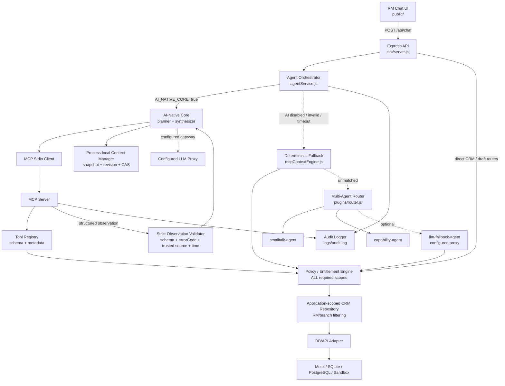
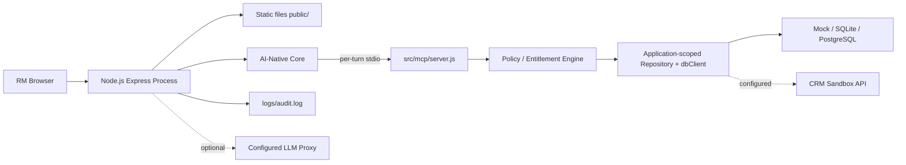

# Phân Tích Kiến Trúc Hệ Thống - BankRM Copilot

> **Tài liệu canonical:** Trang này sở hữu mô tả kiến trúc toàn hệ thống và ranh giới
> MVP/production. Chi tiết runtime AI/MCP nằm tại
> [AI-Native Core Architecture](./ai-native-core.md); contract tool nằm tại
> [MCP Toolkit](../integrations/mcp-toolkit.md). Bắt đầu từ
> [mục lục tài liệu](../README.md) để phân biệt tài liệu hiện hành và lịch sử.

## 1. Mục Tiêu Kiến Trúc

BankRM Copilot là MVP AI Agent cho CRM, hỗ trợ Relationship Manager (RM) của Bank A thao tác bằng tiếng Việt trong các luồng chăm sóc khách hàng. Kiến trúc hiện tại ưu tiên:

- AI planner là đường điều phối chính khi `AI_NATIVE_CORE=true`; deterministic rule engine là fallback.
- MCP client/server là đường thực thi tool chính; schema, allowlist, server-bound entitlement và RM/branch data scope vẫn deterministic.
- Truy vết được nguồn dữ liệu cho từng câu trả lời.
- Giữ ngữ cảnh hội thoại theo `conversationId`.
- Có audit instrumentation best-effort tại các điểm chat, planning và tool/observation; giới hạn coverage/durability được nêu tại §11.
- Có thể chạy local bằng mock data, đồng thời đã có điểm nối sang CRM sandbox API và configured LLM proxy; phê duyệt host/mTLS là bước vận hành riêng trước pilot.

Đây là kiến trúc demo/pilot. Một số thành phần như context store in-memory, audit file local và dữ liệu JSON local chưa phải thiết kế production.

## 2. Tổng Quan Tầng Hệ Thống

Nhìn tổng quát, hệ thống được tách thành các tầng runtime và governance rõ ràng để có đường nâng cấp production:

| Tầng                             | Hiện tại trong repo                                                | Đích production/pilot                                | Vai trò                                                                                                                                      |
| -------------------------------- | ------------------------------------------------------------------ | ---------------------------------------------------- | -------------------------------------------------------------------------------------------------------------------------------------------- |
| RM Experience                    | `public/index.html`, `public/app.js`, `public/styles.css`          | Web app nội bộ sau SSO/RBAC                          | Giao diện chat cho RM, chỉ hiển thị nội dung nghiệp vụ và nhãn nguồn thân thiện.                                                             |
| API Gateway / Backend            | `src/server.js`                                                    | API Gateway nội bộ, auth, rate limit, CORS allowlist | Nhận request HTTP, static hosting, validation cơ bản.                                                                                        |
| Agent Orchestration              | `agentService.js`, `aiNativeCore.js`, planner/synthesizer          | Turn orchestration service có policy checks          | Tạo `auditId`, điều phối AI plan, MCP session, synthesis và deterministic fallback.                                                          |
| MCP Execution                    | `src/mcp/client.js`, `server.js`, `protocol.js`, `toolRegistry.js` | MCP transport có service identity/mTLS               | Initialize, lọc `tools/list`, kiểm tra lại `tools/call`, strict observation schema/error/source/time validation.                             |
| Policy / Entitlement             | `toolPolicy.js`, registry và các application boundaries            | Entitlement/RBAC service tập trung                   | Yêu cầu đủ **tất cả** `requiredScopes`; deny-by-default với `TOOL_SCOPE_DENIED`; wildcard chỉ cho admin khi cấu hình tường minh phía server. |
| Context & Deterministic Fallback | `contextManager.js`, `mcpContextEngine.js`                         | Redis/DB có distributed CAS                          | Giữ context bằng immutable snapshot, monotonic revision và compare-and-swap; xử lý khi AI/MCP không khả dụng.                                |
| CRM Repository / Adapter         | `crmRepository.js`, `dbClient.js`, `crmService.js`                 | Adapter tách interface tới CRM/core banking          | Áp entitlement + RM/branch scope và chọn rõ Mock, SQLite, PostgreSQL hoặc Sandbox. Query pushdown/cursor chưa hoàn tất.                      |
| Data & DB                        | Mock JSON, SQLite/PostgreSQL/Sandbox, NDJSON, `Map` in-memory      | CRM DB/API, Redis context store, audit DB/SIEM       | Lưu dữ liệu nghiệp vụ, context hội thoại, audit và template.                                                                                 |
| Agent Extensions                 | `src/plugins/*`                                                    | Agent registry có governance                         | Multi-agent/smalltalk/capability fallback sau deterministic engine.                                                                          |
| Governance & Observability       | Audit NDJSON không lưu raw RM message; pre-LLM PII token vault     | Immutable audit, DLP/NER, metrics/traces/alerts      | Tuân thủ, truy vết, giảm rò rỉ PII và giám sát vận hành.                                                                                     |

## 3. Component View



Điểm quan trọng: AI core không gọi registry trực tiếp. Planner khám phá catalog đã được lọc theo entitlement qua MCP; registry kiểm tra lại policy ngay trước execution. Repository, direct CRM/draft HTTP routes, deterministic fallback và LLM fallback dùng cùng application policy boundary, nên đổi đường xử lý không bỏ qua quyền.

## 4. Luồng Xử Lý Một Lượt Chat

```mermaid
sequenceDiagram
  participant RM as RM Chat UI
  participant API as Express API
  participant ORCH as agentService
  participant AI as AI-Native Core
  participant MCP as MCP Client/Server
  participant POLICY as Policy / Entitlement
  participant REPO as Application-scoped Repository
  participant FALLBACK as Deterministic Fallback
  participant AUDIT as auditLogger

  RM->>API: POST /api/chat {conversationId, message}
  API->>ORCH: runAgentTurn()
  alt AI_NATIVE_CORE=true and declared data class is permitted
    ORCH->>AI: runAiNativeCore()
    AI->>AI: load immutable context snapshot + revision
    AI->>MCP: initialize + entitlement-filtered tools/list
    AI->>AI: planner selects allowlisted steps within maxSteps
    AI->>AI: validate plan/schema/budget; audit plan
    loop bounded tool steps
      AI->>MCP: tools/call
      MCP->>POLICY: require all server-bound scopes
      POLICY->>REPO: allowed identity + application scope
      REPO-->>MCP: scoped data
      MCP-->>AI: strict {status,data,sources,observedAt,errorCode?}
    end
    AI->>AI: draft context; synthesize + validate grounding
    AI->>AI: derive code-owned sources; CAS context commit
    AI-->>ORCH: {reply,sources,context}
  else AI disabled or AI/MCP invalid/timeout
    ORCH->>FALLBACK: routeConversation()
    FALLBACK->>POLICY: require server-bound scopes
    POLICY->>REPO: deterministic scoped query
    FALLBACK-->>ORCH: {reply,sources,context}
  end
  ORCH->>AUDIT: writeAudit()
  ORCH-->>API: {auditId, reply, sources, context}
  API-->>RM: response + latencyMs
```

`runAgentTurn()` trả contract nội bộ `{ auditId, reply, sources, context }`; route
`POST /api/chat` bọc thêm `latencyMs` ở HTTP envelope. Frontend nhận envelope này nhưng
không hiển thị các thông tin kỹ thuật như `auditId`, `module`, `latencyMs` hay raw
endpoint. UI chỉ thêm nhãn thân thiện như `Đã tham chiếu CRM nội bộ`,
`Đã tham chiếu AI nội bộ` hoặc `Đã tham chiếu dữ liệu nội bộ`.

## 5. Context Model

AI-native path lưu state theo actor + `conversationId` trong `contextManager.js`, có TTL, giới hạn số conversation/focused customer, immutable snapshot và monotonic revision. AI-native và deterministic path đều tạo draft từ snapshot rồi compare-and-swap (CAS) sau khi response hợp lệ:

| Trường             | Ý nghĩa                                                                                                      |
| ------------------ | ------------------------------------------------------------------------------------------------------------ |
| `currentModule`    | Module nghiệp vụ đang active, ví dụ `customer-profile`, `interaction`, `opportunity`, `campaign`, `general`. |
| `focusedCustomers` | Danh sách customer id đang được tham chiếu trong hội thoại.                                                  |
| `lastIntent`       | Intent gần nhất, ví dụ `maturity-reminder`, `email-draft`, `call-script`, `customer-insight`.                |

Context này giúp RM hỏi nối tiếp:

1. RM yêu cầu nhắc khách hàng sắp đáo hạn.
2. Engine lưu các khách hàng vào `focusedCustomers`.
3. RM nói "soạn email cho nhóm này".
4. Engine dùng lại danh sách đã focus để sinh email mà không cần RM nhập lại từng tên.

Context chỉ commit sau khi policy, observation, synthesis/grounding và sources hợp lệ. Observation lỗi dừng trước synthesis và commit; synthesis/source/policy lỗi không ghi đè snapshot cũ. CAS từ chối turn cũ nếu một turn đồng thời đã cập nhật revision.

Giới hạn hiện tại: store vẫn là `Map` process-local, nên mất khi restart và không phối hợp CAS giữa nhiều instance. Redis/database có distributed CAS, TTL và retention là target production.

## 6. Deterministic Fallback Workflow

Các intent dưới đây được `mcpContextEngine.js` xử lý khi AI core bị tắt hoặc thất bại:

| Intent                      | Điều kiện chính                                     | Module             | Nguồn dữ liệu                                               |
| --------------------------- | --------------------------------------------------- | ------------------ | ----------------------------------------------------------- |
| Nhắc tiết kiệm đến hạn      | Phím `1` hoặc câu có `nhắc`, `tiết kiệm`, `đến hạn` | `customer-profile` | `GET /customers`                                            |
| Danh sách chăm sóc hôm nay  | Câu có `hôm nay/ngày nay` + khách/chăm sóc/gọi/gặp  | `customer-profile` | `GET /customers`                                            |
| Soạn email                  | Phím `2`, `soạn email`, `draft`, hoặc câu nối tiếp  | `interaction`      | `GET /customers`, `POST /draft-email`                       |
| Gợi ý cơ hội                | Phím `3`, `cơ hội`, `opportunity`, `gợi ý`          | `opportunity`      | `GET /customers`, `GET /opportunities`                      |
| Xem chiến dịch              | Phím `4`, `chiến dịch`, `campaign`                  | `campaign`         | `GET /campaigns`                                            |
| Call script                 | `call script` hoặc `kịch bản gọi`                   | `interaction`      | `GET /customers`, `POST /call-script`                       |
| Tra cứu theo tên khách hàng | Tên khách hàng khớp CRM hoặc mẫu `khách ...`        | `opportunity`      | `GET /customers`, `GET /opportunities`, `GET /interactions` |

Intent matching luôn đi qua `normalizeVietnamese()` để hỗ trợ tiếng Việt có dấu, không dấu và phím tắt số.

## 7. Data Layer Và CRM Adapter

`toolPolicy.js` kiểm tra capability trước khi dữ liệu được đọc; `crmRepository.js` áp lại entitlement và RM/branch application scope. `dbClient.js` chọn một trong bốn provider:

- `mock`: dữ liệu synthetic local theo quy ước dành cho development/test; runtime chặn mode này khi `NODE_ENV` là `pilot` hoặc `production`.
- `sqlite`: database local read-only qua `CRM_SQLITE_PATH`.
- `postgres`: PostgreSQL qua `CRM_POSTGRES_URL`.
- `sandbox`: CRM API qua `CRM_API_BASE_URL` và `CRM_API_KEY`.

Các hàm nghiệp vụ chính:

- `listCustomers()`, `getCustomerByName()`, `getCustomerById()`.
- `getMaturityCustomers(daysAhead)`.
- `listOpportunities()`, `getCustomerOpportunities(customerId)`.
- `listInteractions()`, `getCustomerInteractions(customerId)`.
- `listCampaigns()`.
- `draftEmailForCustomer(customer, suggestion)`.
- `draftCallScript(customer, suggestion)`.

Provider lỗi sẽ fail closed; hệ thống không tự chuyển sang mock. Pilot/production từ chối `CRM_MODE=mock`. Collection hiện vẫn có thể được provider đọc rồi mới lọc/cắt page trong repository; filter/sort/limit/cursor pushdown xuống PostgreSQL/CRM API là công việc Phase 2.

Mô hình DB logic nên được tách thành các nhóm dữ liệu sau:

| Nhóm dữ liệu           | Hiện tại                                                                                      | Production target                                     |
| ---------------------- | --------------------------------------------------------------------------------------------- | ----------------------------------------------------- |
| `customers`            | `crmData.js`, `large_customers.json`                                                          | CRM customer/profile DB hoặc CRM customer API.        |
| `opportunities`        | `crmData.js`, `large_opportunities.json`                                                      | CRM opportunity DB hoặc sales pipeline API.           |
| `interactions`         | `crmData.js`, `large_interactions.json`                                                       | CRM interaction/activity DB.                          |
| `campaigns`            | `crmData.js`                                                                                  | Marketing campaign DB/API.                            |
| `templates`            | `email_templates.json`, `call_scripts.json`                                                   | Template/config repository có versioning.             |
| `conversation_context` | `Map` có TTL trong `contextManager.js`; fallback có state tương thích                         | Redis hoặc database có TTL theo phiên RM.             |
| `audit_events`         | `logs/audit.log`; API hợp nhất tối đa 200 event gần nhất từ parent memory và MCP child NDJSON | Immutable audit DB, SIEM hoặc log platform tập trung. |

## 8. Multi-Agent Fallback Router

Router trong `src/plugins/router.js` là lớp dự phòng sau deterministic fallback khi intent vẫn chưa được xử lý. Registry hiện có:

| Agent                | Priority | Khi chạy                                                                                           | Vai trò                                       |
| -------------------- | -------- | -------------------------------------------------------------------------------------------------- | --------------------------------------------- |
| `smalltalk-agent`    | 10       | Luôn bật                                                                                           | Chào hỏi, cảm ơn, tạm biệt.                   |
| `capability-agent`   | 20       | Luôn bật                                                                                           | Trả lời agent làm được gì, hướng dẫn sử dụng. |
| `llm-fallback-agent` | 90       | Có `LLM_API_URL` + key vượt kiểm tra gateway và data class tự khai báo là `synthetic`/`anonymized` | Trả lời fallback qua LLM proxy đã cấu hình.   |

Router thử agent theo `priority`. Nếu một agent lỗi hoặc không trả kết quả hợp lệ, router chuyển sang agent kế tiếp. Lỗi agent được ghi audit riêng với provider dạng `agent-error:<agentId>`.

Nguyên tắc bảo mật: không có `LLM_API_URL` và `LLM_API_KEY` thì hệ thống không gọi LLM bên ngoài. Khi bật LLM, fallback chỉ đọc context sau khi đủ ba read scopes, dùng strict JSON, typed sensitive-claim validation và sources do code gắn từ dữ liệu thực tế; output lỗi grounding bị từ chối.

## 9. MCP Toolkit

`src/mcp/server.js` công bố registry qua Model Context Protocol trên stdio. Khi AI core bật và chat turn qua được data-class gate, `src/mcp/client.js` mở một session riêng, gọi `tools/list` và `tools/call`, rồi đóng trong `finally`. Identity/conversation nằm ngoài planner-controlled tool arguments. Khi auth bật, identity được ánh xạ từ token phía server; khi auth tắt ở local development, các header `X-User-Id`, `X-RM-Id`, `X-Role`, `X-Branch-Id` (hoặc giá trị `default`) chỉ là tiện ích demo và không tạo trust boundary bảo mật.

Tool hiện có:

| Tool                     | Chức năng                                                |
| ------------------------ | -------------------------------------------------------- |
| `crm_list_customers`     | Liệt kê khách hàng.                                      |
| `crm_get_customer`       | Tra hồ sơ khách hàng theo tên.                           |
| `crm_customers_due`      | Lấy khách có tiết kiệm đến hạn trong N ngày tới.         |
| `crm_list_opportunities` | Liệt kê cơ hội, có thể lọc theo `customerId`.            |
| `crm_list_interactions`  | Liệt kê lịch sử tương tác, có thể lọc theo `customerId`. |
| `crm_list_campaigns`     | Liệt kê chiến dịch.                                      |
| `crm_draft_email`        | Soạn email follow-up.                                    |
| `crm_call_script`        | Tạo call script.                                         |

MCP session nhận entitlement đã được backend ánh xạ, không nhận quyền từ prompt/tool input. `tools/list` lọc catalog theo nguyên tắc đủ **tất cả** `requiredScopes`; registry kiểm tra lại trước input parsing/execution và trả structured error `TOOL_SCOPE_DENIED` khi bị từ chối. Wildcard chỉ hợp lệ với admin và chỉ khi cấu hình server-bound là chính xác `*`. Policy cùng repository kiểm tra lại quyền ở mọi application path, gồm direct CRM/draft HTTP, deterministic fallback và LLM fallback.

Mỗi tool call đi tới registry, kể cả request bị registry từ chối, đều cố gắng ghi audit với actor/scope và provider `mcp-toolkit`. Tool trả contract strict `{status,data,sources,observedAt,error?,errorCode?}`: success không được có `error/errorCode`; error phải có `data:null`, safe `error` và mã lỗi đã biết. MCP client đối chiếu **chính xác** source với catalog tin cậy nằm trong code, kiểm tra timestamp quá cũ/tương lai và không đưa entitlement/scope vào observation gửi LLM. Collection tool dùng page envelope có `totalCount` và `hasMore`.

## 10. API Surface

| Method | Endpoint                 | Vai trò                                                                                                                            |
| ------ | ------------------------ | ---------------------------------------------------------------------------------------------------------------------------------- |
| `GET`  | `/api/health`            | Health check.                                                                                                                      |
| `POST` | `/api/chat`              | Entry point chính cho chat UI.                                                                                                     |
| `GET`  | `/api/agents`            | Xem registry fallback agent.                                                                                                       |
| `GET`  | `/api/audit-logs`        | Xem recent audit hợp nhất từ parent và MCP child NDJSON; admin-only khi auth bật, còn local auth-disabled không có trust boundary. |
| `GET`  | `/api/crm/customers`     | Danh sách khách hàng.                                                                                                              |
| `GET`  | `/api/crm/opportunities` | Danh sách cơ hội.                                                                                                                  |
| `GET`  | `/api/crm/interactions`  | Lịch sử tương tác.                                                                                                                 |
| `GET`  | `/api/crm/campaigns`     | Danh sách chiến dịch.                                                                                                              |
| `POST` | `/api/draft-email`       | Sinh email cho một khách hàng.                                                                                                     |
| `POST` | `/api/call-script`       | Sinh call script cho một khách hàng.                                                                                               |

Các route CRM/draft trực tiếp kiểm tra entitlement server-bound và trả HTTP `403` với mã ổn định `TOOL_SCOPE_DENIED` nếu thiếu quyền; client header không thể tự cấp scope khi auth bật.

Contract nội bộ của agent (trước khi HTTP route thêm `latencyMs`):

```js
{
  auditId: "uuid",
  reply: "Nội dung trả lời tiếng Việt",
  sources: [{ endpoint: "GET /customers" }],
  context: {
    currentModule: "customer-profile",
    focusedCustomers: ["C001"],
    lastIntent: "maturity-reminder"
  }
}
```

## 11. Audit, Bảo Mật Và Tuân Thủ

Audit hiện tại:

- Mỗi lượt chat tạo `auditId` bằng `crypto.randomUUID()`.
- Chat kết thúc, planning thành công và MCP tool/observation events ghi một tập trường như actor/scope, mã tương quan `conversationId` bằng HMAC-SHA-256 rút gọn, provider, prompt đã sanitize/bound, `sources`, module, decision và latency tùy call site. `AUDIT_CORRELATION_KEY` là khóa riêng bắt buộc khi bật auth hoặc chạy pilot/production; parent truyền đúng khóa này cho MCP child qua env allowlist, không tái sử dụng HTTP/CRM/LLM credential. Local demo không cấu hình key dùng khóa ngẫu nhiên theo process. Giá trị `conversationId` thô do client cung cấp chỉ dùng nội bộ cho context và không được ghi audit; legacy NDJSON được sanitize lại khi đọc. Gateway chưa phát một audit event riêng cho mọi HTTP LLM request/response, nên đây chưa phải bằng chứng end-to-end cho từng proxy call.
- `auditLogger.js` ghi file NDJSON tại `logs/audit.log`, hoặc `/tmp/bankrm-logs` khi chạy trên Vercel.
- `getAuditLogs()` hợp nhất tối đa 200 event gần nhất từ memory parent và NDJSON do MCP child cùng ghi.
- Legacy NDJSON được sanitize lại ở read path. Migration vật lý không chạy tự động: `npm run audit:sanitize-legacy` dry-run mặc định; `--apply` chỉ được ghi sang output mới sau phê duyệt riêng, từ chối overwrite và in-place migration.
- Lỗi ghi file bị nuốt để không làm hỏng chat turn; bản memory có giới hạn vẫn còn trong process nhưng không bảo đảm durability, immutability hay delivery tới SIEM.

Nguyên tắc bảo mật của thiết kế:

- Không train model trên dữ liệu khách hàng.
- LLM gateway yêu cầu HTTPS (trừ loopback), API key và chặn danh sách hostname/suffix vendor trực tiếp đã biết; tên biến `LLM_API_URL` không tự chứng minh hostname thuộc proxy được Bank A phê duyệt.
- `AI_DATA_CLASSIFICATION` là khai báo cấu hình được so với tập `synthetic`/`anonymized`, chưa phải kết quả của data-classification engine hay content inspection.
- Mọi LLM call trong code đi qua gateway/proxy chung; logging đầy đủ tại proxy là yêu cầu vận hành, chưa được repo này kiểm chứng.
- Mọi phản hồi agent/chat có `sources` để truy vết provenance hoặc nguồn dữ liệu; phản hồi CRM dùng endpoint CRM, còn các direct CRM/draft HTTP endpoint dùng envelope `{data}` riêng.
- Entitlement server-bound được kiểm tra ở MCP discovery/execution và mọi đường đọc ứng dụng; thiếu một scope bắt buộc cũng bị deny. Admin wildcard không được suy ra từ role hay header mà phải cấu hình tường minh.
- Planner nhận `maxSteps`; plan vượt budget bị từ chối nguyên vẹn, không truncate, không gọi tool và không synthesis.
- Strict observation validation kiểm tra status/data/errorCode, exact trusted source catalog và timestamp. Entitlement không được đưa vào payload observation cho LLM.
- AI-native và LLM fallback dùng strict JSON, code-owned sources, PII token vault và entity-scoped sensitive-claim validation cho customer/record ID, tên, điện thoại, tài khoản, ngày, tiền và tỷ lệ (kể cả dạng rút gọn/thập phân bằng chữ). Product/policy free text vẫn cần knowledge grounding riêng.
- Frontend không hiển thị metadata kỹ thuật cho RM.

Khoảng trống cần xử lý trước pilot production:

- Đã có demo bearer-token auth, role RM/admin, server-side entitlement mapping và deny-by-default theo capability; còn thiếu SSO/JWT, entitlement service tập trung và production-grade RBAC.
- Provider/DB query scope pushdown chưa hoàn tất; collection có thể vẫn được đọc rồi mới scope/page trong application repository.
- Production cần approved-host allowlist (hoặc proxy identity/mTLS) thay cho chỉ blocklist vendor, đồng thời xác minh logging/retention phía proxy.
- Audit file local chưa đủ cho giám sát tập trung, retention, immutable log.
- Audit đã bỏ raw RM message và mask secret/PII theo key/regex. Planner, synthesizer và fallback token hóa PII nhận diện được trước proxy; production vẫn cần DLP/NER để bao phủ biến thể ngoài regex.
- CORS mặc định `*`, phù hợp demo nhưng cần khóa theo domain nội bộ.
- Context in-memory chưa đáp ứng HA/multi-instance.

## 12. Quy Trình Cyber Security

Quy trình bảo mật đề xuất bám theo vòng đời NIST CSF 2.0: Govern, Identify, Protect, Detect, Respond, Recover. Với BankRM Copilot, mỗi bước cần có owner, evidence và audit register rõ ràng.

| Bước     | Mục tiêu                                                         | Áp dụng cho BankRM                                                                                                                            | Evidence/Register                                                       |
| -------- | ---------------------------------------------------------------- | --------------------------------------------------------------------------------------------------------------------------------------------- | ----------------------------------------------------------------------- |
| Govern   | Thiết lập chính sách, vai trò, risk appetite và yêu cầu tuân thủ | Bank A security policy, phân quyền RM, quy định dùng LLM proxy, không dùng dữ liệu thật trong mock                                            | Security policy register, risk register, data classification register   |
| Identify | Xác định tài sản, dữ liệu, luồng tích hợp và rủi ro              | Inventory API, agent, MCP tool, CRM sandbox, LLM proxy, audit log, mock data                                                                  | Asset inventory, data-flow register, threat model                       |
| Protect  | Kiểm soát truy cập, bảo vệ dữ liệu, giảm rò rỉ PII               | SSO/RBAC, CORS allowlist, secret management, PII masking trước LLM, encryption in transit/at rest                                             | Access review register, secret rotation register, masking test evidence |
| Detect   | Phát hiện bất thường và sự kiện bảo mật                          | Monitor `/api/chat`, LLM fallback, MCP tool call, audit write failure, prompt bất thường                                                      | Security event register, anomaly detection log                          |
| Respond  | Xử lý incident, cô lập, triage, thông báo                        | Tắt LLM, revoke API key, khóa RM session và fail closed hoặc chuyển sang sandbox đã cấu hình rõ; không tự chuyển sang mock ở pilot/production | Incident register, response timeline, containment decision              |
| Recover  | Khôi phục và cải tiến sau incident                               | Restore service, rotate secrets, backfill audit, cập nhật rule/policy/test                                                                    | Recovery register, post-incident review, improvement backlog            |

Luồng security control nên được thêm vào kiến trúc production:

1. RM truy cập qua SSO/RBAC trước khi dùng UI.
2. API Gateway kiểm tra auth, rate limit, CORS allowlist.
3. Agent Orchestrator kiểm tra policy trước khi route intent.
4. PII masking/redaction chạy trước mọi LLM proxy call.
5. CRM Adapter chỉ gọi sandbox/production CRM qua secret được quản lý.
6. Audit Logger ghi immutable event vào audit store/SIEM.
7. Monitoring phát hiện bất thường và tạo incident nếu vượt ngưỡng.
8. Incident response có runbook: disable LLM, revoke key, isolate session, notify owner, recover.

## 13. Quy Trình Tối Ưu Memory Và Thanh Ghi Audit

Trong MVP, state và cache đang nằm trong memory process. Production cần tách rõ memory runtime, context store và audit register để tránh leak dữ liệu, tăng ổn định và truy vết được.

| Hạng mục          | Hiện tại                                                                                                                                                           | Rủi ro                                                          | Quy trình tối ưu                                                                         |
| ----------------- | ------------------------------------------------------------------------------------------------------------------------------------------------------------------ | --------------------------------------------------------------- | ---------------------------------------------------------------------------------------- |
| `contextStore`    | `Map` process-local, TTL, actor isolation, bounds, monotonic revision và CAS                                                                                       | Mất khi restart; CAS không phối hợp giữa nhiều instance         | Chuyển cùng contract sang Redis/DB có TTL, distributed CAS và eviction.                  |
| CRM cached data   | `cachedCustomers`, `cachedOpportunities`, `cachedInteractions` trong process                                                                                       | Cache lớn giữ lâu, dữ liệu cũ, không có invalidation            | Thêm TTL/cache version; phân trang data lớn; lazy load theo intent                       |
| Audit recent logs | Memory tối đa 200 event + recent NDJSON merge; không chứa raw message/client conversation ID, có masking key/regex, legacy read sanitization và mã tương quan HMAC | Regex không thay thế DLP; file local chưa immutable/centralized | Dùng immutable audit store/SIEM, retention policy và kiểm thử redaction production.      |
| Mock large JSON   | Load file `large_*.json` vào memory                                                                                                                                | Tốn memory khi 10k+ khách hàng, scale kém                       | Dùng DB/file index/pagination; chỉ load field cần cho intent; tạo repository query layer |
| LLM context build | MCP page tối đa 50; fallback giới hạn 20/20/10; scoped repository và PII token vault áp trước proxy                                                                | Regex tokenization chưa bao phủ mọi PII; retrieval còn rộng     | DLP/NER + Top-K retrieval theo intent, token budget và policy theo data class.           |

Audit register chuẩn cho mỗi event nên có schema tối thiểu:

```js
{
  auditId: "uuid",
  timestamp: "ISO-8601",
  actorId: "rm-or-system",
  conversationId: "conv_<sha256-reference>",
  action: "chat.turn | mcp.tool | llm.call | security.event",
  provider: "rule-based-mcp-engine | router:* | ai-native-planner | ai-native-mcp | ai-native-error | mcp-toolkit | mcp-client-observation",
  module: "customer-profile | interaction | opportunity | campaign | security",
  sources: ["GET /customers"],
  dataClass: "mock | internal | pii | restricted",
  piiMasked: true,
  decision: "allow | deny | fallback | incident",
  latencyMs: 12,
  memory: {
    contextSize: 0,
    focusedCustomerCount: 0,
    cacheHit: true
  }
}
```

Quy trình tối ưu memory/register:

1. Đo: ghi `contextSize`, `focusedCustomerCount`, cache hit/miss và latency vào audit event.
2. Giới hạn: đặt max focused customers, max prompt/context length, max recent logs.
3. Dọn: TTL cho conversation context, cleanup job cho session hết hạn.
4. Tách: chuyển context sang Redis/DB, audit sang log store/SIEM, CRM data sang DB/API có paging.
5. Mask: loại bỏ PII trước khi ghi audit hoặc gửi LLM.
6. Giám sát: alert khi memory tăng bất thường, audit write fail, context quá lớn, LLM prompt vượt budget.
7. Review: security/memory register được review định kỳ cùng risk register.

## 14. Deployment View Hiện Tại



MVP chạy Express process và tạo MCP child process theo từng AI turn. Guard hiện tại chỉ phát hiện biến môi trường `VERCEL` và mặc định chặn stdio MCP tại đó (có override `MCP_ALLOW_STDIO_ON_SERVERLESS=true`); code không tự nhận diện mọi nền tảng serverless. Khi guard chặn hoặc child process không khả dụng, AI path rơi về deterministic fallback. Production nên tách rõ:

- Web/API runtime sau API gateway.
- Context store dùng Redis hoặc database.
- Audit/observability gửi về SIEM/log platform.
- CRM adapter gọi hệ thống CRM/core banking qua network zone được phê duyệt.
- LLM proxy nằm trong vùng kiểm soát, có logging, masking và policy enforcement.

## 15. Đánh Giá Kiến Trúc Hiện Tại

Điểm mạnh:

- AI planner điều phối động nhưng mọi execution vẫn qua MCP allowlist, entitlement policy, strict observation validation và application-scoped repository.
- Có `sources` và audit log ngay từ MVP.
- Hỗ trợ tiếng Việt có dấu/không dấu qua `normalizeVietnamese()`.
- Dữ liệu mock lớn giúp demo và test nghiệp vụ mà không dùng dữ liệu thật.
- MCP client/server thật, structured observations và deterministic fallback tạo ranh giới mở rộng rõ ràng.

Giới hạn:

- Deterministic fallback vẫn là IF/ELSE trong một file và sẽ khó bảo trì nếu tiếp tục mở rộng intent tại đây.
- Context, cache dữ liệu và audit recent logs đều nằm trong memory.
- CRM adapter cache dữ liệu trong process, chưa có invalidation rõ ràng.
- Stdio child-per-turn cần chuyển sang managed/remote MCP transport nếu runtime production không hỗ trợ child process.
- Entitlement đã có policy dùng chung trong process, nhưng chưa có policy/RBAC service tập trung hoặc lifecycle cấp/thu hồi entitlement production-grade.
- Provider/DB query pushdown chưa hoàn tất; proxy URL mới dùng direct-vendor blocklist, chưa có approved-host allowlist/mTLS.
- Context có snapshot/revision/CAS và commit sau validation, nhưng store process-local chưa cung cấp distributed transaction/CAS.
- Audit hiện là best-effort local/memory và chưa bao phủ riêng từng LLM HTTP exchange.
- Đã có unit/integration/security/CRM scenario coverage; còn thiếu production contract, load và chaos matrix.

## 16. Hướng Nâng Cấp Đề Xuất

| Giai đoạn                 | Nâng cấp                                                                                                                           | Mục tiêu                                                    |
| ------------------------- | ---------------------------------------------------------------------------------------------------------------------------------- | ----------------------------------------------------------- |
| P0 - MVP ổn định          | Mở rộng contract/load/chaos test, kiểm tra source/observation, audit actor và CAS conflict cho mọi response/tool                   | Giữ demo ổn định và dễ truy vết.                            |
| P1 - Context bền vững     | Chuyển context contract hiện có sang Redis/database, giữ TTL, actor isolation và distributed CAS                                   | Hỗ trợ restart và multi-instance.                           |
| P2 - CRM integration      | Thêm provider-side scope/filter/sort/limit/cursor pushdown, contract test và circuit breaker                                       | Tránh tải collection thừa và lẫn dữ liệu demo/dữ liệu thật. |
| P3 - Security pilot       | Thay demo token bằng SSO/JWT + entitlement service, CORS allowlist, approved proxy host/mTLS, pre-LLM redaction và immutable audit | Đạt yêu cầu pilot ngân hàng.                                |
| P4 - Agent expansion      | Tách intent thành registry/rule modules, thêm agent chuyên biệt cho risk/product/NBA                                               | Mở rộng năng lực mà không phình file engine.                |
| P5 - Production readiness | Observability, rate limit, retries, circuit breaker, deployment pipeline                                                           | Vận hành ổn định, giám sát được, an toàn hơn.               |

## 17. Kết Luận

Kiến trúc hiện tại phù hợp cho MVP/pilot có kiểm soát: AI planner + MCP là đường điều phối/thực thi chính khi `AI_NATIVE_CORE=true`, còn deterministic rule engine là resilience fallback. Phase 1 đã đóng entitlement, observation validation và context commit ordering trong một process. Bước tiếp theo là provider query pushdown, context/audit bền vững, entitlement service tập trung và chỉ bật AI sau khi configured proxy vượt phê duyệt host/mTLS, redaction và logging của Bank A.
